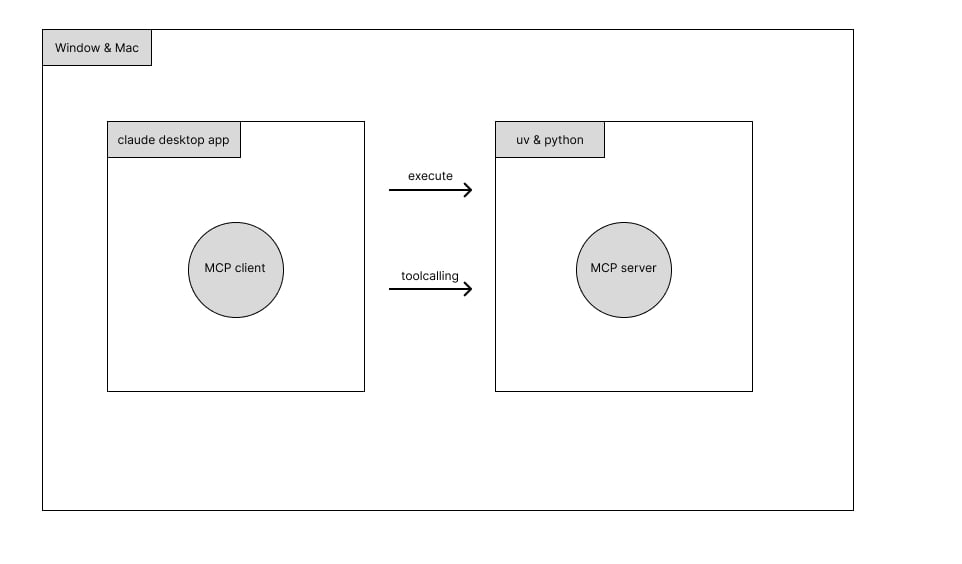
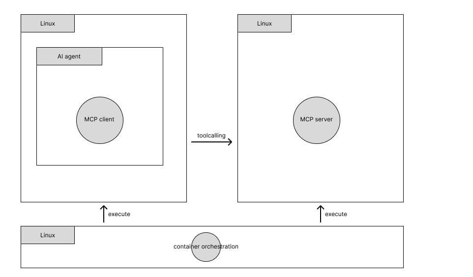
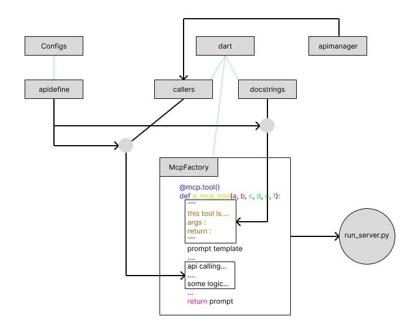

# DART-mcp-server
한국의 전자공시시스템 API를 활용하는 mcp 서버

DART-MCP-서버는 한국의 전자공시시스템(DART) API를 활용하여 Claude와 같은 AI 모델이 상장 기업의 공시 정보에 접근할 수 있게 하는 Model Context Protocol(MCP) 서버입니다. 이 서버를 활용하면 금융 데이터, 기업 공시 정보, 재무제표 등을 AI 모델이 쉽게 분석하고 활용할 수 있습니다.

### MCP란 무엇인가?

MCP(Model Context Protocol)는 대규모 언어 모델(LLM)이 외부 데이터 소스 및 도구와 상호작용할 수 있게 해주는 오픈 프로토콜입니다. 2024년 11월 Anthropic이 발표한 이 프로토콜은 AI 모델이 실시간 데이터에 접근하고 다양한 기능을 활용할 수 있도록 표준화된 방식을 제공합니다.

MCP를 활용하면 AI 시스템이 외부 데이터베이스, API, 파일 시스템 등과 연결되어 더 정확하고 최신 정보를 바탕으로 사용자의 요청에 응답할 수 있습니다.

### 구조



### Futureworks



### 코드구조



1. mcp 툴을 만드는데 원본 함수, 툴 docstring이 필요합니다
2. caller의 원본함수와 docstring 객체의 이름을 일정한 규칙으로 매칭시켜 만들었습니다.
3. apidefine의 데이터로 mcp 툴이름을 통해 caller의 원본함수와 docstring을 불러와서 조립합니다.
4. LLM이 알 필요없는 정적인 인자와 LLM이 논리에따라 입력할 동적 인자를 나누어, 정적 인자를 apidefine에서 미리 정의하여 조립할 때 사용합니다.
5. McpFactory객체가 apidefine에 있는 툴의 모든리스트에 대해 조립을하여 메인 스크립트인 run_server.py에서 선언합니다.

## DART-MCP-서버 기능

DART-MCP-서버는 다음과 같은 전자공시시스템(DART) API 기능을 제공합니다:

- **공시검색**: 기업의 공시 정보를 검색합니다.
- **기업개황**: 기업의 기본 정보를 조회합니다.
- **고유번호 조회**: 기업의 고유번호를 검색합니다.
- **증자(감자) 현황**: 기업의 증자/감자 정보를 확인합니다.
- **그 외 다양한 재무 정보**: 배당, 자기주식, 최대주주, 임원 현황 등 다양한 정보에 접근할 수 있습니다.

## 설치 요구 사항

DART-MCP-서버를 사용하기 위해 필요한 사항:

1. [VScode](https://code.visualstudio.com/) 설치
2. [Python](https://www.python.org/downloads/) 설치
3. [uv](https://github.com/astral-sh/uv) (Python 패키지 관리자) - 설치 후 vscode 재시작
4. [Claude Desktop](https://claude.ai/download) 앱
5. [DART API 키 (금융감독원 전자공시시스템에서 발급)](https://opendart.fss.or.kr/uss/umt/EgovMberInsertView.do)

## 서버 설치 및 설정 방법

### 1. DART-MCP-서버 다운로드

GitHub에서 DART-MCP-서버 코드를 다운로드합니다:

```bash
git clone https://github.com/snaiws/DART-mcp-server.git
cd DART-mcp-server
cd dart
```

### 2. 필요한 패키지 설치

UV를 사용하여 필요한 패키지를 설치합니다:

```bash
# 가상 환경 생성 및 활성화
uv sync
```

### 3. DART API 키 발급받기

1. [DART API 키 신청 페이지](https://opendart.fss.or.kr/api/signup.do)에서 회원가입 후 API 키를 발급받습니다.
2. 발급받은 API 키를 안전하게 보관하세요.

### 4. Claude Desktop 설정

1. Claude Desktop 앱을 설치하고 실행합니다.
2. Claude 메뉴에서 “파일(File)” - "설정(Settings)"을 클릭합니다.
3. 좌측 메뉴에서 "개발자(Developer)"를 선택하고 "설정 편집(Edit Config)"을 클릭합니다.
4. 설정 파일이 열리면 다음내용에서 경로를 수정하여 DART-MCP-서버 설정으로 추가합니다:
    
    ```json
    {
        "mcpServers": {
            "DART": {
                "command": "uv",
                "args": [
                    "--directory",
                    "C:\\Users\\Snaiws\\code\\Projects\\mcp\\DART-mcp-server\\mcp_server",
                    "run",
                    "run_server.py"
                ],
                "env":{
                    "DART_API_KEY" : "your-dart-api-key"
                }
            }
        }
    }
    ```
    
5. 설정 파일을 저장합니다.
6. 클로드 좌측 메뉴에서 “파일” - “종료”를 클릭해서 종료 후 재시작합니다.

## 서버 사용법

### Claude에서 도구 사용하기

Claude Desktop 앱을 재시작하면 하단 입력창에 도구 아이콘(해머 모양)이 표시됩니다. 이 아이콘을 클릭하면 DART-MCP-서버가 제공하는 도구 목록을 확인할 수 있습니다.

### 예시 질문

Claude에게 다음과 같은 질문을 할 수 있습니다:

- "삼성전자의 최근 공시 정보를 검색해줘"
- "네이버의 기업 개황을 알려줘"
- "카카오의 증자 현황을 분석해줘"
- "현대자동차와 기아자동차의 최근 재무제표를 비교해줘"
- "SK하이닉스의 최대주주 현황을 보여줘"

### 주의사항

API키를 claude에게 채팅으로 알려줘야합니다. 안알려주면 claude가 물어볼 겁니다. 가끔 안물어보고 아무 값이나 넣을 때도 있으니 주의하세요.

# todo
1. API request functions(DART)
   1. 공시정보
      1. 공시검색✔️
      2. 기업개황✔️
      3. 공시서류원본파일
      4. 고유번호✔️
   2. 정기보고서 주요정보
       1. 증자(감자) 현황✔️
       2. 배당에 관한 사항
       3. 자기주식 취득 및 처분 현황
       4. 최대주주 현황
       5. 최대주주 변동현황
       6. 소액주주 현황
       7. 임원 현황
       8. 직원 현황
       9. 이사·감사의 개인별 보수현황(5억원 이상)
       10. 이사·감사 전체의 보수현황(보수지급금액 - 이사·감사 전체)
       11. 개인별 보수지급 금액(5억이상 상위5인)
       12. 타법인 출자현황
       13. 주식의 총수 현황
       14. 채무증권 발행실적
       15. 기업어음증권 미상환 잔액
       16. 단기사채 미상환 잔액
       17. 회사채 미상환 잔액
       18. 신종자본증권 미상환 잔액
       19. 조건부 자본증권 미상환 잔액
       20. 회계감사인의 명칭 및 감사의견
       21. 감사용역체결현황
       22. 회계감사인과의 비감사용역 계약체결 현황
       23. 사외이사 및 그 변동현황
       24. 미등기임원 보수현황
       25. 이사·감사 전체의 보수현황(주주총회 승인금액)
       26. 이사·감사 전체의 보수현황(보수지급금액 - 유형별)
       27. 공모자금의 사용내역
       28. 사모자금의 사용내역
   3. 정기보고서 재무정보
      1. 단일회사 주요계정
      2. 다중회사 주요계정	
      3. 재무제표 원본파일(XBRL)	
      4. 단일회사 전체 재무제표	
      5. XBRL택사노미재무제표양식	
      6. 단일회사 주요 재무지표	
      7. 다중회사 주요 재무지표	
   5. 지분공시 종합정보
      1. 대량보유 상황보고
      2. 임원, 주요주주 소유보고
   7. 주요사항보고서 주요정보
      1. 자산양수도(기타), 풋백옵션
      2. 부도발생
      3. 영업정지
      4. 회생절차 개시신청
      5. 해산사유 발생
      6. 유상증자 결정
      7. 무상증자 결정
      8. 유무상증자 결정
      9. 감자 결정
      10. 채권은행 등의 관리절차 개시
      11. 소송 등의 제기
      12. 해외 증권시장 주권등 상장 결정
      13. 해외 증권시장 주권등 상장폐지 결정
      14. 해외 증권시장 주권등 상장
      15. 해외 증권시장 주권등 상장폐지
      16. 전환사채권 발행결정
      17. 신주인수권부사채권 발행결정
      18. 교환사채권 발행결정
      19. 채권은행 등의 관리절차 중단
      20. 상각형 조건부자본증권 발행결정
      21. 자기주식 취득 결정
      22. 자기주식 처분 결정
      23. 자기주식취득 신탁계약 체결 결정
      24. 자기주식취득 신탁계약 해지 결정
      25. 영업양수 결정
      26. 영업양도 결정
      27. 유형자산 양수 결정
      28. 유형자산 양도 결정
      29. 타법인 주식 및 출자증권 양수결정
      30. 타법인 주식 및 출자증권 양도결정
      31. 주권 관련 사채권 양수 결정
      32. 주권 관련 사채권 양도 결정
      33. 회사합병 결정
      34. 회사분할 결정
      35. 회사분할합병 결정
      36. 주식교환·이전 결정
   9. 증권신고서 주요정보
      1. 지분증권
      2. 채무증권
      3. 증권예탁증권
      4. 합병
      5. 주식의포괄적교환,이전
      6. 분할
3. docstrings
4. test
5. docker
